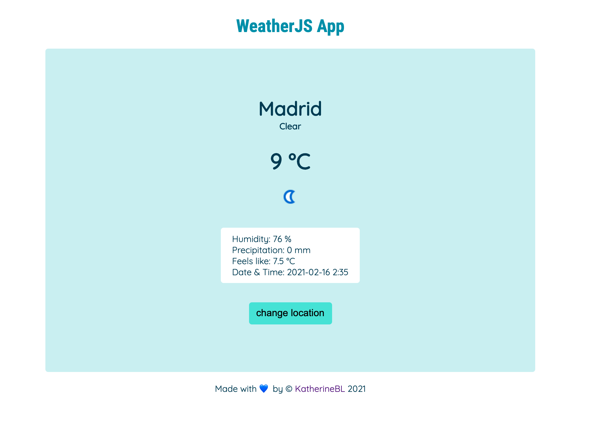

# weatherApp-javascript

I built this weather app with vanilla JS and CSS, the data persists in local storage so you can refresh the browser and your data will still be there 😊

You can try it [here:](https://katherinebl.github.io/weatherApp-javascript/)

✨Thank you for visiting✨
